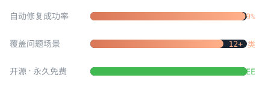

<div align="center">

[](./) [](ENREADME.md)

</div>

<p align="center">
  <a href="./">
    
  </a>
</p>

<h1 align="center">🔧 Claude Boot Fixer</h1>

<p align="center">
  <b>修复 <code>claude</code> 命令打不开的一切问题</b><br>
  Windows · PowerShell · 纯脚本 · 零依赖 —— 一条命令，原地复活。
</p>

<div align="center">

[](https://www.microsoft.com/windows) [](https://learn.microsoft.com/powershell) [](https://github.com/anthropics/claude-code) [](https://code.claude.com/docs/en/skills) [](https://opensource.org/license/mit)

</div>

<div align="center">

[](./) [](./) [](./compare) [](./)

</div>

<div align="center">

[](#-快速开始) [](#-项目结构) [](#-错误速查) [](#-常见问题) [](./) [](./issues) [](./fork)

</div>

<p align="center">
  <sub>
    <a href="#-开源宣言">开源宣言</a> ·
    <a href="#-特性一览">特性</a> ·
    <a href="#-为什么选择">为什么选择</a> ·
    <a href="#-三种启动方案">启动方案</a> ·
    <a href="#-隐私与安全声明">隐私</a> ·
    <a href="#-贡献指南">贡献</a> ·
    <a href="#-开源协议">协议</a>
  </sub>
</p>

---

## 🌟 开源宣言

<p align="center">
  
</p>

> 献给每一个在深夜敲下 `claude`，却只得到一句 **「无法识别」** 的你。
>
> 我们相信：
>
> - **命令永远不应该沉默。** 报错，就该有答案；坏了，就该能修好。
> - **工具应当透明。** 纯脚本、零依赖、零魔改 —— 每一行代码，你都能读懂。
> - **开源理应无价。** 免费、公开、可分发，让每一次修复都被全世界复用。
>
> 因此，我们写下这份宣言：
>
> > **只要还有一台 Windows 机器打不开 Claude Code，这个仓库就永远在线。** 🔥

---

## ✨ 特性一览

<table>
  <tr>
    <td width="50%" align="center">
      <p><b>⚡ 自动恢复 exe</b></p>
      <p align="left"><sub>自动更新把 <code>claude.exe</code> 改名成 <code>.old.*</code>？启动器内置自动还原，双击即愈。</sub></p>
      <p align="center"><a href="scripts/fix-claude.cmd">查看脚本 →</a></p>
    </td>
    <td width="50%" align="center">
      <p><b>🛡 危险模式一键切换</b></p>
      <p align="left"><sub><code>--danger</code> 参数或模式菜单，绕过权限检查不再弹窗，也能随时切回普通模式。</sub></p>
      <p align="center"><a href="scripts/claude-danger.cmd">查看脚本 →</a></p>
    </td>
  </tr>
  <tr>
    <td width="50%" align="center">
      <p><b>🧭 12 类错误全对照</b></p>
      <p align="left"><sub>从「命令不存在」到「Defender 拦截」，每条报错都有原因和修复命令。</sub></p>
      <p align="center"><a href="references/troubleshooting.md">查看对照表 →</a></p>
    </td>
    <td width="50%" align="center">
      <p><b>🪟 三种接入方案</b></p>
      <p align="left"><sub>Profile 函数 / PATH 前置 / 包装脚本覆盖，总有一种适配你的习惯。</sub></p>
      <p align="center"><a href="#-三种启动方案">查看方案 →</a></p>
    </td>
  </tr>
</table>

---

## 🏆 为什么选择 Claude Boot Fixer

<p align="center">
  
</p>

| 维度 | 🛠 本工具 | 🙅 手动修复 |
|---|---|---|
| 定位安装目录 | **全自动**（`%CLAUDE_DIR%` 或自动查找 `node_modules`） | 凭记忆手动找路径 |
| 恢复被改名的 exe | **自动还原**，双击即愈 | 手动 `ren` 且每次都要重来 |
| 危险模式 | **一条命令**（`--danger`） | 手输长参数 / 反复改配置 |
| 错误排查 | **12 类对照表**，症状 → 原因 → 命令 | 打开搜索引擎大海捞针 |
| 维护成本 | **零依赖纯脚本**，一行一行读得懂 | 打补丁式的临时方案 |

---

## 🚀 快速开始

<p align="center"></p>

**安装为 Claude Code Skill**（把本文件夹放进技能目录）：

```powershell
# 1. 克隆或下载本仓库（点击上方绿色按钮）
# 2. 把整个文件夹放到：
#    C:\Users\<你的用户名>\.claude\skills\claude-boot-fixer\
# 3. 可选：设置安装根目录（不设置也会自动查找 node_modules）
setx CLAUDE_DIR "D:\tools\claude-code"
```

**立即修复**（任选其一）：

| 入口 | 作用 |
|---|---|
| [fix-claude.cmd](scripts/fix-claude.cmd) | 稳定启动器：自动定位 + 恢复 exe + 模式菜单，支持 `--danger` |
| [claude-danger.cmd](scripts/claude-danger.cmd) | 一键危险模式启动器 |
| [SKILL.md](SKILL.md) | 完整技能文档：诊断流程 + 全部修复命令 |

**验证**：

```powershell
claude --version
# 期望输出: x.x.x (Claude Code)
```

---

## 🛠 三种启动方案

让输入 `claude` 时直接走稳定启动器，而不是裸调 `claude.exe`：

<table>
  <tr>
    <td width="33%" align="center"><b>方案 A · Profile 函数</b><br><sub>⭐ 推荐 · 优先级最高，不受解析顺序影响</sub></td>
    <td width="33%" align="center"><b>方案 B · PATH 前置</b><br><sub>把启动器放 <code>%USERPROFILE%\bin</code>，置顶 PATH</sub></td>
    <td width="33%" align="center"><b>方案 C · 覆盖包装脚本</b><br><sub>覆盖 <code>node_modules\.bin\claude.cmd</code>（重装会覆盖）</sub></td>
  </tr>
  <tr>
    <td align="center"><a href="SKILL.md#method-a">查看详情 →</a></td>
    <td align="center"><a href="SKILL.md#method-b">查看详情 →</a></td>
    <td align="center"><a href="SKILL.md#method-c">查看详情 →</a></td>
  </tr>
</table>

顺带修复手滑：`Set-Alias cluade claude` —— 打错命令也能启动。

---

## 🧭 错误速查

| 症状 | 直达对照表 |
|---|---|
| ❌ 无法将 `claude` 项识别为 cmdlet | [启动类错误 →](references/troubleshooting.md#start-errors) |
| 🔁 系统找不到指定的文件 / exe 被改名 | [启动类错误 →](references/troubleshooting.md#start-errors) |
| 🚫 禁止运行脚本（执行策略） | [启动类错误 →](references/troubleshooting.md#start-errors) |
| 🟢 `node` 不是内部或外部命令 | [启动类错误 →](references/troubleshooting.md#start-errors) |
| ⚔️ 全局 / 本地安装冲突、版本不符 | [启动类错误 →](references/troubleshooting.md#start-errors) |
| ⌨️ `cluade` 打错命令 | [启动类错误 →](references/troubleshooting.md#start-errors) |
| 💤 启动卡死 / 更新锁残留 | [启动类错误 →](references/troubleshooting.md#start-errors) |
| 🦠 启动即退出，exe 消失（Defender） | [启动类错误 →](references/troubleshooting.md#start-errors) |
| 📦 安装 / 下载失败（pnpm、npm） | [安装类错误 →](references/troubleshooting.md#install-errors) |
| 🔑 401 / 403 API 认证失败 | [API / 连接类错误 →](references/troubleshooting.md#api-errors) |
| 🌐 timeout / ECONNREFUSED 连不上 | [API / 连接类错误 →](references/troubleshooting.md#api-errors) |
| ⚠️ 危险模式无法切换 / 看不到 bypass | [危险模式相关 →](references/troubleshooting.md#danger-setup) |

> 💡 配置 DeepSeek 等第三方 API 的环境变量写法见 [SKILL.md → 配置环境变量](SKILL.md#env-deepseek)。

---

## 📁 项目结构

| 类型 | 文件 | 说明 |
|---|---|---|
| 📖 主文档 | [SKILL.md](SKILL.md) | 技能核心：诊断流程 + 12 类问题修复 + 三种接入方案 |
| 🎨 界面元数据 | [agents/openai.yaml](agents/openai.yaml) | 技能展示名、品牌色、默认提示词 |
| 🧭 对照表 | [references/troubleshooting.md](references/troubleshooting.md) | 完整错误信息 ↔ 原因 ↔ 修复命令 |
| 🚀 启动器 | [scripts/fix-claude.cmd](scripts/fix-claude.cmd) | 稳定启动器（自动恢复 + 模式菜单 + `--danger`） |
| 🛡 危险模式 | [scripts/claude-danger.cmd](scripts/claude-danger.cmd) | 一键危险模式启动器 |
| 🎬 横幅 | [assets/banner.svg](assets/banner.svg) | 首页动画横幅 |
| 💚 呼吸灯 | [assets/pulse.svg](assets/pulse.svg) | 状态指示灯 |
| 📊 数据条 | [assets/stats.svg](assets/stats.svg) | 动画统计条 |
| 🛡 安全盾 | [assets/shield.svg](assets/shield.svg) | 隐私安全动画（描边自绘 + 对勾打勾） |
| 🚀 火箭 | [assets/rocket.svg](assets/rocket.svg) | 快速开始动画（火焰 + 烟雾 + 漂浮） |
| 🇬🇧 英文版 | [ENREADME.md](ENREADME.md) | English Version · Read this repo in English |

---

<p align="center"></p>

## 🛡 隐私与安全声明

> 本仓库在发布前经过**全文件隐私审计**，公开之前逐字检查。审计结果：

- ✅ **无任何 API Key / Token / 密钥** —— 所有密钥一律以 `<你的 Key>` 占位符形式出现
- ✅ **无个人邮箱、无用户名、无真实本地路径**
- ✅ **所有路径均为通用写法**（`%CLAUDE_DIR%`、`%USERPROFILE%`），不含任何机器信息
- ✅ **纯脚本、零依赖、零网络上报** —— 代码不会把任何信息发往外部
- ✅ 引用到唯一外部服务是公开 API 地址（如 `api.deepseek.com`），属正常文档内容

**请求每一位使用者**：如果你 Fork 或复刻本仓库，请同样不要提交任何真实密钥。开源透明，但安全第一。🔒

---

## ❓ 常见问题

<details>
<summary><b>设置了 <code>CLAUDE_DIR</code> 还是提示找不到？</b></summary>
<br>
检查变量名是否拼写正确（区分大小写），并确认是<strong>新开的终端</strong>（环境变量修改不会对已打开的窗口生效）。还不行的话，把脚本放在项目目录下运行，它会自动查找 <code>node_modules</code>。→ <a href="SKILL.md">完整流程见 SKILL.md</a>
</details>

<details>
<summary><b>危险模式还是报 <code>--print</code> 的错误？</b></summary>
<br>
新版 Claude Code 需要先在 <code>%USERPROFILE%\.claude\settings.json</code> 中开启 <code>permissions.allowDangerouslySkipPermissions: true</code>。→ <a href="references/troubleshooting.md#danger-setup">危险模式配置</a>
</details>

<details>
<summary><b>Defender 总把 exe 当病毒删掉？</b></summary>
<br>
Windows 安全中心 → 保护历史记录 → 恢复文件，并为 <code>%CLAUDE_DIR%</code> 添加排除目录。→ <a href="references/troubleshooting.md#start-errors">启动类错误对照表</a>
</details>

<details>
<summary><b>这个仓库会泄露我的 API Key 吗？</b></summary>
<br>
不会。仓库里所有密钥都以 <code>&lt;你的 Key&gt;</code> 占位符出现，发布前做过全文件审计。→ <a href="#-隐私与安全声明">隐私与安全声明</a>
</details>

---

## 🤝 贡献指南

欢迎一切形式的贡献 —— 报 bug、提需求、改文档、写代码，哪怕只是一个错别字：

<div align="center">

[](./fork) [](./issues) [](./compare)

</div>

**几条简单约定：**

1. 🔒 **永不提交真实密钥 / Token / 邮箱** —— 一律使用占位符
2. 🧱 保持纯脚本、零依赖 —— 不引入新运行时
3. 📝 新错误场景请同时补充到 `troubleshooting.md` 对照表
4. 💬 提交信息写清楚「修了什么」，方便大家阅读

---

## ⚖️ 开源协议

[MIT License](https://opensource.org/license/mit) —— 自由使用、自由修改、自由分发。做你想做的，唯一的要求是保留作者声明。

---

<div align="center">

[](./) [](./fork) [](./issues) [](ENREADME.md)

</div>

<p align="center">
  <sub>Made with ❤️ + ⚡ PowerShell · 本 README 全部链接均为仓库内相对链接，克隆 / 改名后依然可点</sub>
</p>
